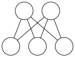

# Grundlegende Eigenschaften planarer Graphen

## planare Einbettung:
Graph $G = (V,E)$ kann dargestellt werden indem man die Knoten aus V auf Punkte im $ℝ²$ und die Kanten aus E auf Jordan-Kurven (d.h. stetige sich selbst nicht kreuzende Kurven) zwischen den Endpunkten abdeckt.

G heißt _planar_ wenn es eine Darstellung gibt, bei der sich die Kanten höchstens in einem gemeinsamen Endpunkt berühren.

- planare Einstellung zerlegt Ebene in _Facetten_ (Gebiete, Flächen)
- planare Einbettung, die durch ihre Facetten bzw. die Reihenfolge der Kanten in Adjazenzlisten beschrieben ist, heißt _kombinatorische Einbettung_
- planare Einbettung, die durch Koordinaten der Punkte beschrieben ist, heißt _geometrische Einbettung_

Facettenmenge $\mathcal{F}$, $|\mathcal{F}| = f$

## Satz von Euler (1790):

In einem zusammenhängenden nichtleeren planaren Graph $G=(V,E)$ gilt für jede planare Einbettung (geg. durch $\mathcal{F}$), dass $$n-m+f=2$$ (wobei $|V|=n, |E|=m, |\mathcal{F}| = f$)

__Beweis__ per Induktion über m:

__IA__: $m=0$, es ist $n=1, f=1$ ⇒ Beh.

Sei also m ≥ 1

_Fall 1:_ G enthalte einen Kreis

⇒ es existiert $l \in E$ so dass $G':= G - e = (V, E \setminus e)$ ebenfalls zusammenhängend und e an zwei Facetten grenzt die zu einer Facette in G' werden.

⇒ f' #Facetten von G' erfüllt $$ f' = f - 1 \underset{IV}{\implies} n - (m-1) + f' = 2$$ $$\implies n-m+f = 2 $$

_Fall 2:_ G enthält keinen Kreis, ist also Baum und $|\mathcal{F}| = 1$ . Für beliebige $e \in E$ zerfällt $G' = G - e$ in zwei Zusammenhangskomponenten $G_1 = (V_1, E_2)$ und $G_2 = (V_2, E_2)$ und nach IV: $$n_1 - m_1 + f_1 = 2, n_2 - m_2 + f_2 = 2$$

Da $$ n=n_1 + n_2, m=m_1 + m_2 - 1 $$$$ \implies n-m+f = n_1 + n_2 - m_1 - m_2 - 1 +1 = \equalto{(n_1 - m_1 + 1)}{2}+\equalto{(n_2-m_2 + 1)}{2} - 2 = 2$$

__Folgerungen:__

- \#Facetten ist für jede planare Einbettung von G gleich
- \#Kanten eines Baumes mit n Knoten ist n-1

_Lemma:_ Ein planarer Graph mit n Knoten ($n \geq 3$) hat höchstens $3n - 6$ Kanten.

_Beweis:_ o.B.d.A sei G maximal planar (d.h. Hinzunahme weiterer Kanten zerstört Planarität)

`Bild`

Dann ist für jede planare Einbettung jede Facette ein Dreieck und jede Kante grenzt an genau zwei Facetten.

$$ 3 f = 2 m $$
$$ \underset{mit~Euler}{=} $$
$$ 3 (2-n+m) = 6-3n+3m $$

_Lemma:_ Sei G pl. Graph mit mind 3 Knoten. $d_{max}(G)$ bezeichne Maximalgrad in G, $n_i$ \#Knoten von Grad i.

Dann gilt: $$6n_0 + 5n_1 + 4n_2 + 3n_3 + 2n_4 + n_5 \geq n_7 + 2n_8 + 3n_9 + \dots + (d_{max}(G) - 6) * n_{d_{max}(G)} + 12$$

_Beweis:_ Es gilt $n = \sum_{i=0}^{d_{max}(G)} n_i$ und $2m=\sum_{i=0}^{d_{max}(G)} i \cdot n_i.$

Da $m \leq 3n - 6$ folgt $$6 \sum_{i=0}^{d_{max}(G)}  n_i = 6n \geq 2m + 12 = \sum_{i=0}^{d_{max}(G)} i \cdot n_i + 12$$

_Folgerung:_ Jeder planare Graph enthält mind. einen Knoten v mit $d(v) \leq 5$.

---

## Dualität von Schnitten und Kreisen

`Bild Dualgraph`

Planarer Graph G mit Einbettung $\mathcal{F}_i$ Dualgraph $G^*$ dazu. Dann gilt:

Ein Schnitt  in G ($\widehat{=}$ entspr. Kantenmenge) induziert eine Menge von Kreisen in $G^*$ und umgekehrt.

## Minor bzw. Unterteilung

`Bild G' Subgraph von G`

$G' = (V', E')$ heißt _Subgraph_ von $G=(V,E)$ wenn $V'\subseteq V$ und $E' \subseteq E$.

$G'=(V',E')$ heißt _Unterteilung_ von $G=(V,E)$ wenn $G'$ aus $G$ entsteht indem man Kanten von G durch einfache Wege ersetzt.

Ein Graph H heißt _Minor_ von G wenn H aus G entsteht durch Löschen von Knoten oder/und Kanten und/oder Knotenkontraktion von Knoten von Grad 2.

H ist _Minor_ von G falls G eine Unterteilung von H als Subgraph enthält.

`Bild G' Unterteilung von G`

`Bild G' Minor von G`

## Satz von Kuratowski (1930)

Ein Graph $G=(V,E)$ ist genau dann planar wenn er weder $K_5$ noch $K_{3,3}$ als Minor enthält.

"⇒" klar, da $K_5$ und $K_{3,3}$ nicht planar.

"⇐": Es ist also "nur" zu zeigen: Wenn G nicht planar, dann enthält G einen $K_5$ oder $K_{3,3}$ als Minor.

### Vorbereitung des Beweises

Figure: $K_{3,2}$

Nehme Graph der $K_{3,2}$ als Minor enthält $θ$-Graph ($θ$ Minor von $K_{3,2}$)
